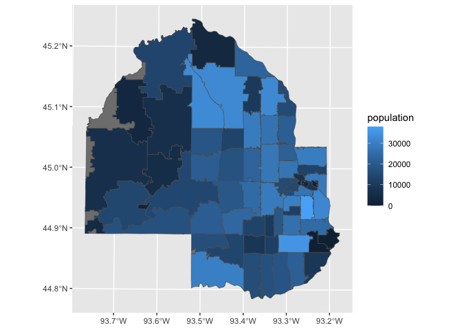
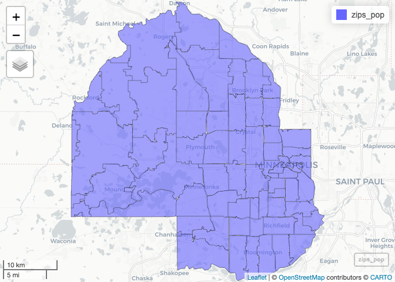
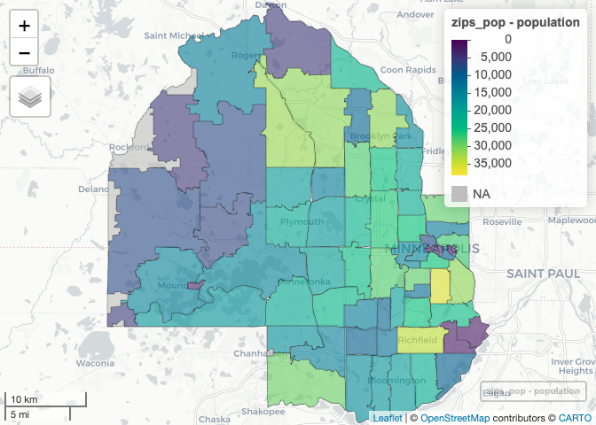

# DST 490 Day 11 - Maps and Geocomputation in R


## Preliminaries

Today we will need the following packages. You may need to install them
if you don’t have them yet on your local `R` installation.

- `tidyverse` (per the usual)
- `sf` (for processing spatial data)
- `here` (for removing directories / file management issues)
- `zipcoder` (for acquiring zipcode information)
- `mapview` (another mapping package)
- `tmap` (another mapping package)

As a reminder, you can use `install.packages("PKGNAME")`.

## Loading in a shapefile

I’ve already downloading a shapefile for [zipcodes in Hennepin
county](https://gis-hennepin.hub.arcgis.com/datasets/zip-codes/explore).
This is located in the `shapefiles` folder. The following code will help
you get that read in:

``` r
# load up the packages
library(tidyverse)
library(sf)
library(here)   ### Helps with file management directories


# Read in the zipcode shapefile
zips <- st_read(dsn = here::here("day11","shapefiles","Zip_Codes"), layer = "Zip_Codes")
```

    Reading layer `Zip_Codes' from data source 
      `/Users/zobitz/Desktop/DST 490 Materials/DST490_R_Files/day11/shapefiles/Zip_Codes' 
      using driver `ESRI Shapefile'
    Simple feature collection with 75 features and 5 fields
    Geometry type: MULTIPOLYGON
    Dimension:     XY
    Bounding box:  xmin: 439356.4 ymin: 4959128 xmax: 486031.7 ymax: 5010414
    Projected CRS: NAD83 / UTM zone 15N

``` r
glimpse(zips)
```

    Rows: 75
    Columns: 6
    $ OBJECTID   <int> 1, 2, 3, 4, 5, 6, 7, 8, 9, 10, 11, 12, 13, 14, 15, 16, 17, …
    $ FEATURECOD <int> 314, 314, 314, 314, 314, 314, 314, 314, 314, 314, 314, 314,…
    $ NAME_TXT   <chr> "55111", "55305", "55311", "55316", "55327", "55331", "5534…
    $ ShapeSTAre <dbl> 9125743.2, 24522911.2, 45602453.7, 23140808.8, 50275721.0, …
    $ ShapeSTLen <dbl> 16170.586, 22973.241, 44195.397, 25587.966, 38365.225, 4909…
    $ geometry   <MULTIPOLYGON [m]> MULTIPOLYGON (((484487.6 49..., MULTIPOLYGON (…

## The zipcodeR package

Next we will use the zipcodeR package to get a listing of all the
zipcodes in Hennepin County:

``` r
# load up the packages
library(zipcodeR)


# Read in the zipcodes in Hennepin County
hennepin_zips <- search_county("Hennepin","MN")


# Let's glimpse to see the results:
glimpse(hennepin_zips)
```

    Rows: 104
    Columns: 24
    $ zipcode                 <chr> "55111", "55305", "55311", "55316", "55323", "…
    $ zipcode_type            <chr> "Standard", "Standard", "Standard", "Standard"…
    $ major_city              <chr> "Saint Paul", "Hopkins", "Osseo", "Champlin", …
    $ post_office_city        <chr> "Saint Paul, MN", "Hopkins, MN", "Osseo, MN", …
    $ common_city_list        <blob> <78, 9c, 8b, 56, 0a, 4e, cc, cc, 2b, 51, 08, …
    $ county                  <chr> "Hennepin County", "Hennepin County", "Hennepi…
    $ state                   <chr> "MN", "MN", "MN", "MN", "MN", "MN", "MN", "MN"…
    $ lat                     <dbl> 44.88, 44.95, 45.12, 45.18, NA, 45.21, 44.90, …
    $ lng                     <dbl> -93.20, -93.43, -93.49, -93.38, NA, -93.47, -9…
    $ timezone                <chr> "Central", "Central", "Central", "Central", NA…
    $ radius_in_miles         <dbl> 2, 3, 6, 3, NA, 4, 7, 6, 3, 3, 3, 3, 4, NA, 4,…
    $ area_code_list          <blob> <78, 9c, 8b, 56, 32, 33, 34, 52, d2, 51, 50, …
    $ population              <int> 0, 19368, 32788, 23089, NA, 3478, 17524, 6327,…
    $ population_density      <dbl> NA, 2080, 1999, 2827, NA, 194, 1172, 175, 3168…
    $ land_area_in_sqmi       <dbl> 0.00, 9.31, 16.40, 8.17, NA, 17.89, 14.96, 36.…
    $ water_area_in_sqmi      <dbl> 0.00, 0.15, 0.85, 0.56, NA, 1.75, 7.10, 0.65, …
    $ housing_units           <int> 0, 10009, 11985, 8598, NA, 1278, 7203, 2236, 1…
    $ occupied_housing_units  <int> 0, 9241, 11560, 8328, NA, 1235, 6666, 2162, 11…
    $ median_home_value       <int> NA, 285600, 308800, 202300, NA, 252200, 436400…
    $ median_household_income <int> NA, 66298, 106029, 84768, NA, 86393, 108911, 1…
    $ bounds_west             <dbl> -93.22309, -93.47187, -93.55448, -93.42283, NA…
    $ bounds_east             <dbl> -93.17849, -93.39818, -93.43147, -93.32833, NA…
    $ bounds_north            <dbl> 44.89928, 44.97884, 45.17893, 45.21196, NA, 45…
    $ bounds_south            <dbl> 44.86198, 44.92487, 45.06506, 45.15120, NA, 45…

Two things to notice: a lot of zipcodes get returned (perhaps more than
we expected) and it also contains population level open data from the
U.S. Census Bureau and Department of Housing & Urban Development.

Next we will join in the zipcode data to our shapefile. To maintain all
the observations in the shapefile, we will use a `left_join` versus an
`inner_join`. We will also use `str_extract` to get out the first three
digits of the zip code:

``` r
# make the Hennepin county zip codes a smaller dataset

small_hennepin_zips <- hennepin_zips |>
  select(zipcode,population,post_office_city)

zips_pop <- zips |>
  left_join(small_hennepin_zips,by=c("NAME_TXT"="zipcode")) |>
  st_make_valid()
```

### Alternatives to leaflet (1 / 3): ggplot

We can use `ggplot` to make a plot of the data - the benefit is that we
are familiar with the structure of `ggplot`:

``` r
ggplot(zips_pop) +
  geom_sf(aes(fill = population)) 
```



### Alternatives to leaflet (2 / 3): mapview

The [mapview package](https://r-spatial.github.io/mapview/index.html) is
an alternative that allows for both static and interactive maps. The
good part is that we don’t need to reproject the data - that is already
taken into consideration. The code is structured similar to `ggplot`:

``` r
library(mapview)

# Compare the two plots:
zips_pop |>
  mapview()
```



``` r
zips_pop |>
  mapview(zcol = "population")   # Variable name needs to be in quotes!
```



The benefit to mapview is that you can “print the map” (or effectively a
screenshot) of the image using the `mapshot` command. More information
on how to do that is here:
[LINK](https://r-spatial.github.io/mapview/reference/mapshot.html)

### Alternatives to leaflet (3 / 3): tmap

The third option is the [tmap package](https://r-tmap.github.io/tmap/).
Similar to `mapview`, it has a structure consistent with `ggplot`, but
doesn’t have some of the fancy stylings like `ggplot`.

``` r
library(tmap)

# Compare the two plots:
tm_shape(zips_pop) + 
  tm_polygons()
```


``` r
tm_shape(zips_pop) + 
  tm_polygons("population")   # Note the name of the variable in quotes
```


## tidycensus

The R package
[tidycensus](https://walker-data.com/tidycensus/index.html) has
information at the census tract level from the American Community Survey
or the Decennial census. Read through the basic usage of this package:
[LINK](https://walker-data.com/tidycensus/articles/basic-usage.html).

You will need to get a free API key:
<http://api.census.gov/data/key_signup.html>

    Warning: package 'tidycensus' was built under R version 4.5.2

    [1] "name"      "label"     "concept"   "geography"

The `acs_var_2020` has the following variables:

- `name`: The code in the ACS survey to refer to a particular variable
- `label`:
- `concept`: What is being measured. This may be most useful to you.
- `geography`: Level of spatial organization.

Let’s take a look at all the distinct listings for each variable:

``` r
acs_var_2020$name |> n_distinct()
```

    [1] 27850

``` r
acs_var_2020$label |>  n_distinct()
```

    [1] 11925

``` r
acs_var_2020$concept |> n_distinct()
```

    [1] 1138

``` r
acs_var_2020$geography |> n_distinct()
```

    [1] 6

``` r
acs_var_2020$geography |> unique()
```

    [1] "tract"       "block group" NA            "us"          "county"     
    [6] "state"      

Wow! There are a lot of variables. One way to filter through the data is
with the census tract (most closely aligned with what the scale of the
project).

``` r
acs_var_2020_tract <- acs_var_2020 |>
   filter(geography == "tract")
```

One variable of interest is `B22001_001`, which is the following:

``` r
acs_var_2020_tract |>
  filter(name == "B22001_001") |> 
  glimpse()
```

    Rows: 1
    Columns: 4
    $ name      <chr> "B22001_001"
    $ label     <chr> "Estimate!!Total:"
    $ concept   <chr> "RECEIPT OF FOOD STAMPS/SNAP IN THE PAST 12 MONTHS BY PRESEN…
    $ geography <chr> "tract"

To acquire that variable for Hennepin County census tracts, we need to
get the variable `name`:

``` r
hennepin_60 <- get_acs(geography = "tract",
                    variables = c(snap_60 = "B22001_001"),
                    state = "MN",
                    county = "Hennepin",
                    year = 2020
                    )
```

    Getting data from the 2016-2020 5-year ACS

``` r
glimpse(hennepin_60)
```

    Rows: 329
    Columns: 5
    $ GEOID    <chr> "27053000101", "27053000102", "27053000300", "27053000601", "…
    $ NAME     <chr> "Census Tract 1.01, Hennepin County, Minnesota", "Census Trac…
    $ variable <chr> "snap_60", "snap_60", "snap_60", "snap_60", "snap_60", "snap_…
    $ estimate <dbl> 1085, 1752, 1371, 1953, 1411, 930, 959, 377, 1351, 912, 683, …
    $ moe      <dbl> 157, 203, 128, 132, 261, 111, 132, 88, 149, 130, 108, 119, 15…

Awesome! Now we have the estimate of residents in each census tract,
aged 60+ who are receiving SNAP benefits.

`tidycensus` is a great resource to quickly access data and reports from
the U.S.Census Bureau

**YOUR TURN:** In day 10 I provided a geoJSON dataset of census tracts
in Hennepin county. Join that data to `hennepin_60` to make a
chloropleth map of residents 60+ receiving SNAP benefits in each census
data tract.

``` r
# TYPE YOUR RESPONSE HEERE
```
